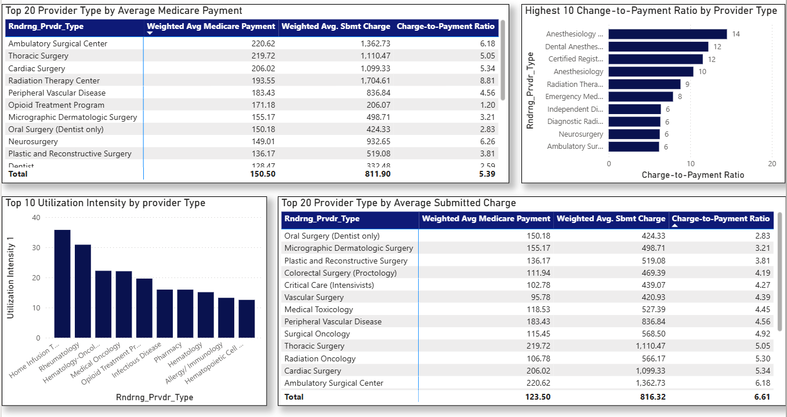
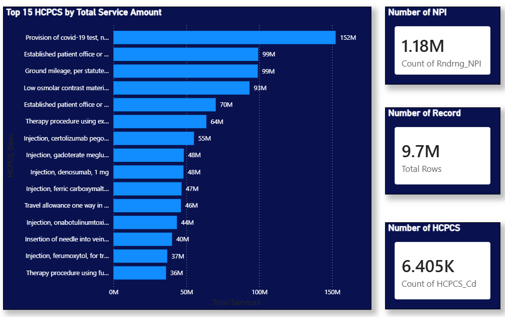
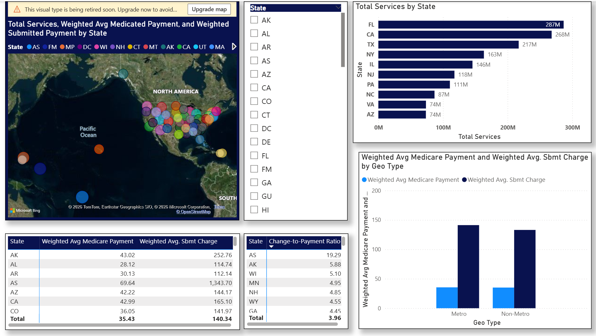
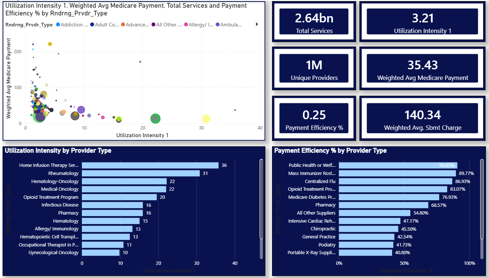

# Medicare Provider Payment Analysis

Power BI analysis of 9.7 million Medicare records examining provider billing patterns, payment efficiency, and geographic variation across healthcare services.

## Project Overview

**Objective:** Analyze CMS Medicare Part B payment data to uncover patterns in provider billing, identify reimbursement efficiency gaps, and examine geographic variation in healthcare service delivery and costs.

**Scale:** 9.7 million records | 1.18 million unique providers | 6,405 procedure codes (HCPCS)

**Key Questions:**
- Which provider types have the largest gap between charges and Medicare payments?
- How does service utilization intensity vary across specialties?
- Are there geographic disparities in Medicare reimbursement?
- What services account for the highest Medicare spending volume?

---

## Key Findings

### 1. Systemic Pricing Gap
- **Providers charge 4× what Medicare pays on average** ($140.34 submitted vs. $35.43 paid)
- **Anesthesia specialties show the most extreme gaps:** 10-15× charge-to-payment ratios
- **Public Health agencies most efficient:** 90.85% payment-to-charge ratio (1.10× multiplier)

### 2. Inverse Relationship: Volume vs. Intensity
- **High-volume services** (labs, office visits): Low per-beneficiary intensity (2.57 services/beneficiary)
- **High-intensity services** (infusion therapy, oncology): Small populations, frequent treatments (35.77 services/beneficiary)
- **Implication:** Require fundamentally different cost management strategies

### 3. COVID-19 Testing Dominates Volume
- 152.4 million COVID-19 test services far exceeding 2nd place (99M office visits)
- Represents significant portion of total 2.64 billion services
- May skew aggregate metrics if not accounted for in analysis

### 4. Geographic Variation in Charges, Not Payments
- **Metro providers charge more** ($141.24 avg) than non-metro ($133 avg)
- **Medicare pays nearly identical** amounts in both settings ($35.40 metro vs. $35.10 non-metro)
- **Standardized payment amounts** effectively neutralize geographic cost differences

### 5. Provider Type Payment Insights
- **Ambulatory Surgical Centers:** Highest Medicare payment ($220.62 avg)
- **Radiation Therapy Centers:** Highest submitted charges ($1,704.61 avg)
- **Home Infusion Therapy:** Highest utilization intensity (35.77 services/beneficiary)
- **Clinical Laboratory:** Highest total volume (380.4M services)

---

## Dashboard Overview

### Page 1: Provider Type Analysis
- Top 20 provider types by weighted average Medicare payment and submitted charges
- Charge-to-payment ratio rankings
- Utilization intensity by provider type

### Page 2: Service Volume Analysis
- Top 15 HCPCS codes by total service volume
- KPI cards: 2.64B total services, 1.18M providers, 9.7M records, 6,405 procedures
- Service distribution analysis

### Page 3: Geographic Analysis
- Interactive U.S. map showing services, payments, and charges by state
- Metro vs. Non-Metro comparison
- Charge-to-payment ratios by geography
- State-level deep dive with filters

### Page 4: Utilization & Efficiency
- Scatter plot: Utilization intensity vs. payment (bubble size = volume)
- Payment efficiency rankings
- Provider type performance matrix

---

## Dashboard Previews

### Provider Type Analysis

*Top 20 provider types with charge-to-payment ratios and utilization metrics*

### Service Volume Analysis

*Top HCPCS codes showing COVID-19 testing dominance at 152.4M services*

### Geographic Analysis

*State-level visualization with Florida leading at 287M services*

### Utilization & Efficiency and Key Metrics Dashboard

*Bubble chart showing inverse relationship between volume and intensity. Executive summary with weighted averages and payment efficiency indicators*

---

**Note:** The Power BI report file (.pbix) is not included due to file size (600MB+ with embedded data). Screenshots provide comprehensive visibility into dashboard design and analysis. Full report available upon request for portfolio review.

---

## Data Source & Methodology

### Dataset
- **Source:** Centers for Medicare & Medicaid Services (CMS)
- **Platform:** [Data.gov](https://data.gov/)
- **Dataset:** Medicare Physician & Other Practitioners - by Provider and Service
- **Year:** 2023
- **License:** Public Domain (U.S. Government Work)
- **Direct Link:** [Medicare Physician and Other Practioners](https://catalog.data.gov/dataset/medicare-physician-other-practitioners-by-provider-and-service-b156e/resource/e838fdc0-64ee-4055-acb0-8ca21ab6082a)

### Data Structure
- **Records:** 9.7 million rows
- **Grain:** One row = One provider (NPI) performing one service (HCPCS code)
- **Providers:** 1.18 million unique National Provider Identifiers (NPIs)
- **Services:** 6,405 distinct HCPCS procedure codes
- **Geographic Coverage:** All 50 U.S. states, D.C., and territories

### Key Fields
| Field | Description |
|-------|-------------|
| `Rndrng_NPI` | National Provider Identifier (unique provider ID) |
| `HCPCS_Cd` | Healthcare Common Procedure Coding System (service code) |
| `Rndrng_Prvdr_Type` | Provider specialty (e.g., Internal Medicine, Cardiology) |
| `Tot_Srvcs` | Total number of services performed |
| `Tot_Benes` | Total unique beneficiaries served |
| `Avg_Sbmtd_Chrg` | Average amount provider charged Medicare |
| `Avg_Mdcr_Pymt_Amt` | Average amount Medicare actually paid |
| `Avg_Mdcr_Stdzd_Amt` | Standardized payment amount (geography-adjusted) |

---

## Technical Implementation

### Data Preparation (Power Query)
- **9.7M row dataset** loaded via Power Query
- Removed unnecessary columns for performance optimization
- Merged **state/territory geocoding table** for map visualization
- Created **Metro vs. Non-Metro classification** from RUCA codes
- Applied conditional columns for provider type groupings

### DAX Calculated Measures
Because payment columns are **pre-averaged at provider-service level**, simple averages would incorrectly weight high-volume and low-volume providers equally. All financial metrics use **weighted averages**:
```DAX
Weighted Avg Submitted Charge = 
DIVIDE(
    SUMX(ProviderData, [Avg_Sbmtd_Chrg] * [Tot_Srvcs]),
    SUM(ProviderData[Tot_Srvcs])
)

Weighted Avg Medicare Payment = 
DIVIDE(
    SUMX(ProviderData, [Avg_Mdcr_Pymt_Amt] * [Tot_Srvcs]),
    SUM(ProviderData[Tot_Srvcs])
)

Charge-to-Payment Ratio = 
DIVIDE(
    [Weighted Avg Submitted Charge],
    [Weighted Avg Medicare Payment],
    BLANK()
)

Utilization Intensity = 
DIVIDE(
    SUM(ProviderData[Tot_Srvcs]),
    SUM(ProviderData[Tot_Benes]),
    BLANK()
)

Payment Efficiency % = 
DIVIDE(
    [Weighted Avg Medicare Payment],
    [Weighted Avg Submitted Charge],
    BLANK()
)
```

### Supplementary Analysis
- **Data validation:** Cross-checked aggregations against CMS published totals
- **Performance optimization:** Reduced column count, optimized data types

---

## Skills Demonstrated

- **Power BI Desktop:** Interactive dashboard design, 4-page report with drill-through
- **Power Query (M):** ETL on 9.7M records, table merges, conditional columns
- **DAX:** Weighted averages, DIVIDE for safe division, calculated measures, KPI cards
- **Data Modeling:** Star schema with fact table (9.7M rows) and dimension tables
- **Healthcare Analytics:** Understanding of HCPCS codes, NPI system, Medicare payment structure
- **Statistical Analysis:** Weighted averages, ratio analysis, utilization intensity metrics
- **Geographic Visualization:** U.S. state mapping with custom geocoding
- **Data Storytelling:** Translating 9.7M records into actionable business insights

---

## Business Impact & Implications

### For Healthcare Payers (CMS)
- **Cost management focus:** High-intensity, low-volume services (infusion, oncology) require different oversight than high-volume, low-intensity services (labs, office visits)
- **Audit priorities:** Anesthesia billing shows 10-15× charge ratios, potential area for fee schedule review
- **COVID-19 impact:** 152.4M test services represent significant spending; evaluate necessity and reimbursement rates

### For Healthcare Providers
- **Reimbursement expectations:** Understand that charges are 4× higher than payments on average; set budgets based on actual payment rates, not submitted charges
- **Specialty economics:** ASCs and radiation centers have high payments but also high capital costs; utilization intensity must justify infrastructure investment
- **Geographic strategy:** Medicare standardizes payments across metro/non-metro areas; location-based pricing strategies are ineffective for Medicare revenue

### For Policy Analysts
- **Payment standardization works:** Geographic payment variations are minimal despite charge differences
- **Outlier territories:** American Samoa's 19.29× charge ratio suggests need for targeted provider education or fee schedule adjustments
- **Utilization patterns:** Inverse volume-intensity relationship indicates two fundamentally different models of care delivery

---

## Contact

**Sarina Gurung**  
Data Analyst | MS Business Analytics

- Email: sarinagurung012@gmail.com
- LinkedIn: [linkedin.com/in/sarina-gurung-a69b79324](https://www.linkedin.com/in/sarina-gurung-a69b79324/)

---

## License & Data Attribution

**Data License:** Public Domain (U.S. Government Work - CMS/data.gov)

**Analysis & Dashboard:** Original work by Sarina Gurung (2026)

**This project is available for educational and portfolio purposes.**

---

**If you found this analysis helpful, please star this repository!**
